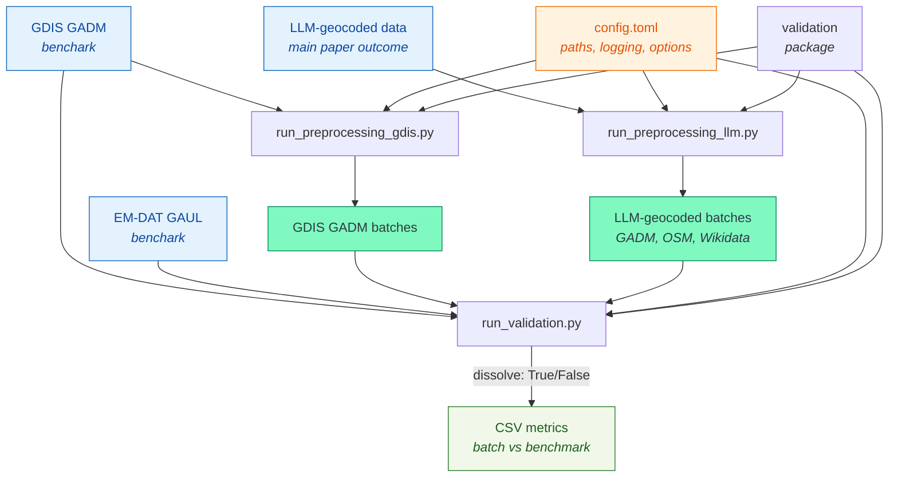

# EM-DAT Geocoding — Validation and Comparison

Code repository associated with the paper: 

> Ronco, M., Delforge, D., Jäger, W. S., & Corbane, C. (2025). 
> Subnational Geocoding of Global Disasters Using Large Language Models 
> (No. arXiv:2511.14788). arXiv. https://doi.org/10.48550/arXiv.2511.14788

and the data repository: https://doi.org/10.5281/zenodo.17544931

This repository contains the code used for LLM-assisted geocoding in the above 
reference, and the validation and comparison of LLM-assisted geocoded EM-DAT 
disaster data (LLMGeoDis) described in the paper and available from the data 
repository. 

LLM-geocoded location geometries are validated against two benchmarks:
- GDIS: a GADM‑based geocoding benchmark
- EM‑DAT GAUL: official EM‑DAT geometries

It also compares GDIS and EM‑DAT GAUL together for additional insights.
Geometric comparisons are primarily area‑based.

The LLM-geocoded units are compared both individually or dissolved 
by the EM-DAT `DisNo.` disaster event identifier to compare the entire 
geocoded disaster impact footprint.

## Key features

- Batch preprocessing for GDIS and LLM‑assisted EM‑DAT locations
- Geometry indices: geodetic area, containment ratios, Jaccard (IoU)
- Vectorized operations with geometry hygiene (validity, dissolve when needed)
- Config‑driven paths/parameters via `config.toml`
- Structured logging and reproducible outputs with config snapshots

## Workflow diagram

For the geocoding workflow, shared in `geocoding\run_geolocation.py`, we refer 
to the aforementioned reference for implementation details.

For the comparison and validation workflow, the diagram below shows its main 
steps of the workflow. The `run_all.py`
orchestrates the steps.

## Project structure

### Geocoding workflow

- `geocoding/run_geolocation.py` — geocoding workflow (independent code)

### Validation/comparison workflow

- `config.toml` — central configuration (paths, logging, options)
- `validation/geom_indices.py` — area/overlap metrics
- `validation/io.py` — IO helpers for file parsing, GPKG batches, CSVs
- `validation/validation.py` — batch comparison pipelines and metrics

- `run_preprocessing_gdis.py` — prepare GDIS batches
- `run_preprocessing_llm.py` — prepare LLM‑assisted EM‑DAT batches
- `run_validation.py` — run validations between sources
- `run_all.py` — orchestrate end‑to‑end runs
- `output/` — results, logs; per‑run stamped filenames
- `data/` — lightweight inputs (no geometries)

See also: 
- `comparison_figures.ipynb` for a statistical synthesis of the results.
- `visual_validation.ipynb` and the `validation_samples` folder for random 
  result samples and visualizations.

## Installation

- Python 3.13+
- Dependencies listed in `pyproject.toml` (and locked in `uv.lock`)

## Input data

Because of the size of the data, it is not included in the repository, except
for the following lightweight data inputs:

- EM‑DAT Excel archive (lightweight):
    - Path: `data/241204_emdat_archive.xlsx`
    - Description: EM-DAT FAIR Archive covering the 1900-2023 period.
    - Source/DOI: https://doi.org/10.14428/DVN/I0LTPH
    - Refer to the source for terms of use and redistribution.
- GDIS DisNo. CSV mapping:
    - Path: `data/gdis_disnos.csv`
    - Description: List of EM-DAT DisNo. disaster identifiers geocoded by GDIS.
    - Source/DOI: https://doi.org/10.7927/ZZ3B-8Y61
    - Refer to the source for terms of use and redistribution.

In addition, the following data is required for the full workflow:

- The complete GDIS dataset, including GADM version 3.6. geometries,
  downloadable from the above DOI.
- The GAUL version 2015, which can be joined by
  attributes to the EM-DAT data.
  See [this tutorial](https://doc.emdat.be/docs/additional-resources-and-tutorials/tutorials/python_tutorial_2/)
  for details.
- LLMGeoDis is available from the data repository: https://doi.org/10.5281/zenodo.17544931
- GADM version 4.1 is available from the GADM website: 
  https://gadm.org/data.html

For reuse, we refer to the above sources for terms of use and redistribution.

## Geometry and CRS conventions

- Storage CRS: EPSG:4326
- Area computations: geodetic area calculations (used default)

## Validation metrics and outputs

Computed in `validation/geom_indices.py`.

For each pair of geometries A (candidate) and B (benchmark):

- `area_a`, `area_b` — areas (square meters)
- `intersection_area`, `union_area`
- `a_in_b` = |A ∩ B| / |A| — containment of A by B
- `b_in_a` = |A ∩ B| / |B| — containment of B by A
- `jaccard` = |A ∩ B| / |A ∪ B| — Intersection over Union
- `a_contains_b` = 1 if A contains B, 0 otherwise
- `b_contains_a` = 1 if B contains A, 0 otherwise
- `a_contains_b_properly` = 1 if A strictly contains B, 0 otherwise
- `b_contains_a_properly` = 1 if B strictly contains A, 0 otherwise

We refer to the `shapely` and `geopandas` documentation for further 
geoprocessing details.

Calculated metrics are stored in the `output/` directory, with the following
naming convention:

> <BATCH_NAME>_<BENCHMARK_NAME>_<BATH_NUMBER>.csv

when no dissolve operation is applied to merge geometries by DisNo.
disaster identifiers, or

> <BATCH_NAME>_<BENCHMARK_NAME>_<BATH_NUMBER>_dissolved.csv

when dissolve operation is applied.
